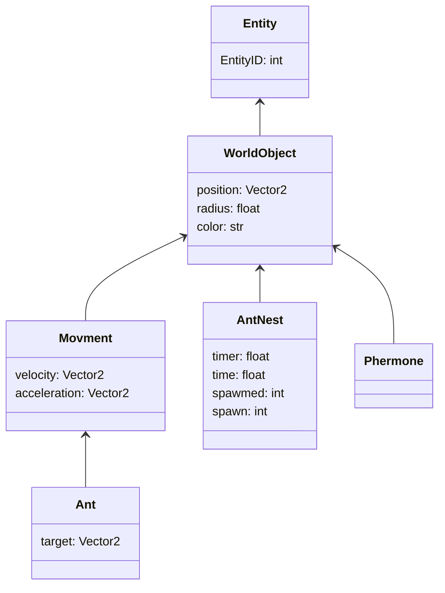

# Object Structure
Ideally this would be cheged to a commponent system instead of inheritance

```mermaid
classDiagram
    Entity <-- WorldObject
    WorldObject <-- Movment
    Movment <-- Ant
    WorldObject <-- AntNest
    WorldObject <-- Phermone
    class Entity {
        EntityID: int
    }
    class WorldObject {
        position: Vector2
        radius: float
        color: str
    }
    class AntNest {
        timer: float
        time: float
        spawmed: int
        spawn: int
    }
    class Movment {
        velocity: Vector2
        acceleration: Vector2
    }
    class Ant {
        target: Vector2
    }
```
